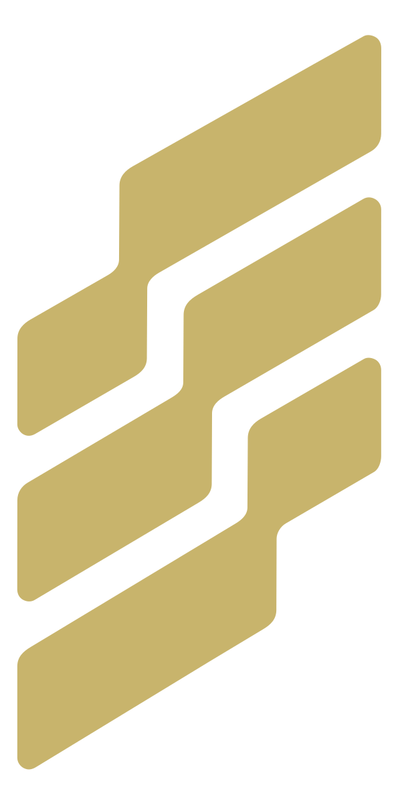

<div align="center">



# Talaria

**The operations platform for companies that run on people *and* agents.**

[](./LICENSE)
[](#quick-start)

**[Join the cloud waitlist](https://talariaworks.ai/#waitlist)** · [What's inside](#one-room) · [Quick start](#quick-start)

</div>

---

Your workday right now isn't a workflow. It's a scavenger hunt with a subscription fee.

Talaria is a multiplayer workspace where the whole workday is at your fingertips, and agents are coworkers. Everyone collaborate across the entire platform, sharing deep, historical context. Agents get smarter as your team works together to build whatever it is you're passionate about.

| Surface | What it is |
| :--- | :--- |
| **Chat** | One central chat between coworkers and agents. Agents get context from conversations and can work across Talaria and connected tools. |
| **Boards** | Project management with agentic workflows and human-in-the-loop built in. Workchains allow programmatic task orchestration across any project. |
| **Knowledge** | Your company wiki in one place. Knowledge accessible by humans and agents, contextualized across Talaria. |
| **Plans** | Think out loud beside an agent and coworkers while an agents plan alongside you. When it's ready, your agents can build tickets and organize your project. |
| **Research** | Ask real questions, get a real answers with sources. A Perplexity grade research harness, multiplayer by default. |
| **Files** | The stuff work produces: sheets, docs, sites, files. Versioned and shareable, with a first class Google Drive integration. |

## Agents as coworkers

Everything in Talaria is sharable and multiplayer, like a real workplace. An agent isn't just a panel
bolted to the side of your screen. It's a coworker you pull in day-to-day anywhere you're currently working:

- **Hire one like you'd brief a recruiter.** Describe the job, and Talria drafts the whole agent for you. A full Heremes agent, ready to start working in under 30s.
- **@mention one in a channel.** It answers in the thread, streaming live, having actually read the context.
- **Open a plan with one.** You talk, it drafts, the document appears. Your teammates can join too! Finished the plan? Your planning agent will build it into tickets for you and your team.
- **Assign a ticket.** Tickets worked by humans or agents. Agents work the problem one step at a time, until it's done or until it needs a human.
- **Walk away from a conversation without guilt.** Idle threads distill into memory instead of cluttering your UI or getting buried under four hundred newer messages.

Each agent in Talaria can be a departmental specialist, and every person on your team gets an assistant of their own:
named how they like, tuned to their work, acting on their behalf exactly where they'd delegate.

> AI is something your team *uses*. An agent is someone your team *employs*.

## What's under the hood

Every agent in Talaria is a full [Hermes](https://github.com/outsourc-e/hermes-workspace) agent
underneath. It has its own memory, its own skills, its own way of
working a problem, and it loops until the thing is actually solved. It learns your business the
way new people do, through the real work.

Changes to an agent deploy like software: a fresh one comes up beside the old, and traffic cuts
over only when the new one is healthy.

## Keep your stack

Talaria speaks MCP, so all your apps come along. (Yes, the repos too, if you've got them.) Workspace level MCP with fine-tunable permissions, as well as per-user MCP are all built in. 
The MCP marketplace makes it easy to find and connect to the tools you already use.

Google Workspace is already a first class citizen, with Microsoft 365 on the way soon.

## Talaria SDK

Use our SDK to build your own apps and harnesses that plug into the rest of Talaria natively. Forget about spinning up 
another new micro app on another new subdomain... Use your custom tooling right there in Talaria, alongside all your existing agents and context, then give them skills and tools to use them.

## Guardrails and human-in-the-loop by default

- **Human sign-off is structural.** Agents can't assign themselves work or close their own
  tickets, for example.
- **Permissions are real.** A fine-grained catalog, per-person and per-agent, resolved
  server-side on every request.
- **Secrets stay sealed.** Real encryption and one-click rotation, configs never hold a
  live credential. Secret management built into platform tooling as a default, usable by agents with a token grant system.
- **Everything is on the record.** Every agent action is tied back to what it affected in the platform. Get full insight into what your team is doing, and what it costs.

## Cloud soon?

### → [Join the cloud waitlist](https://talariaworks.ai/#waitlist)

Talaria is open source, and self-hosting will be= free forever. We are committing to ensuring that the self-hosted version never becomes 
a neutered sales pitch to pay for our cloud. If you'd rather use your own compute and you have the chops to manage infrastructure, the entire app deploys as a docker compose. 
The cloud will simply be the easy button for businesses that would rather focus on work instead of managing infrastructure.

One honest note, this is beta software right now. The platform is moving fast. Expect little bugs here and there, and never be afraid to open an issue or submit a PR. We're committed to making this something your team can't live without.

## Quick start

Prerequisites: 
[Docker](https://docs.docker.com/get-docker/)
[Bun](https://bun.sh)

To develop on Linux you also need [mold](https://github.com/rui314/mold), which the Rust api links with. With [mise](https://mise.jdx.dev), `mise install` in the repo sets up mold and the pinned Rust, Bun, and Node in one go.

Podman is untested.

### Developing

```bash
git clone https://github.com/outcrop-labs/talaria && cd talaria
bun talaria setup     # secrets, config, deps, puts the `talaria` CLI ref on your PATH
talaria dev           # the whole dev stack → http://localhost:5273
```

### Production Deployment

```bash
git clone https://github.com/outcrop-labs/talaria && cd talaria
bun talaria setup     # secrets, config, deps, puts the `talaria` CLI ref on your PATH
talaria deploy up         # build + start the stack → http://localhost:5273
talaria service install   # optional, Linux: keep it running across reboots
```

Open the app and claim the instance: the account you create there is the admin. Then add an
LLM provider on `/models`, set your organization in Admin, and describe your first agent on `/agents`.

For hosting the app on a live domain, we recommend using a Cloudflare Tunnel. It's the cleanest way to prevent unauthorized access to your infrastructure.

### Deployment topology: one instance

**One Talaria app instance per deployment** — one app process against one Postgres/Redis
pair. For now, scale the box (CPU, RAM), not the instance count.

**What's already multi-instance-safe:** the background scheduler and the durable runs
plane. Scheduled jobs take a Redis lease — one run per interval, fleet-wide — except the
`per_instance` ones whose input is this process's own memory or this host's docker,
which run on every instance on purpose. Work dispatch derives each run's id
deterministically, so two racing dispatchers converge on the same session and the
primary key refuses the loser. Durable runs lease one step and release immediately; an
expired lease is a reclaim signal, so any instance can pick up the next step. See
[`docs/ARCHITECTURE.md`](./docs/ARCHITECTURE.md), "Jobs and durable runs".

**What isn't:** the TS ui plane. The SPA shell, app-module compiling
([`ui/src/server/app-build/`](./ui/src/server/app-build/)), and the permanent TS
residents (the app-server gateway, app-MCP dispatch, healthz) assume they are one
process — two instances over one apps dir would race app compiles (the in-flight guard
is per-process). And process-local queues defeat failover: the notify mail outbox is
the user-visible one — an instance that dies with mail queued strands it, and no other
instance can drain it. The in-app notification survives; the queued mail does not.

**Multi-instance would need:**

- shared or routed per-instance job queues, instead of process-local outboxes
- cross-instance coordination for app-module compiles — shared build artifacts or a
  compile lease
- any remaining process-local caches made shared, or made irrelevant
- per-instance identity in health checks and observability

**Related but different:** running more than one instance per *host* is per-host compose
isolation — separate `COMPOSE_PROJECT_NAME` and state dirs — not multi-instance against
one shared Postgres/Redis. See [`docs/CONTAINER.md`](./docs/CONTAINER.md).

### Manual Updates

```bash
talaria deploy update  # Updates the entire docker stack and rolls live
```

The long version of all of our container commands and the dirty details can be found here:
[`docs/CONTAINER.md`](./docs/CONTAINER.md).

#### IMPORTANT
> Back up your `TALARIA_SECRET_KEY` somewhere safe!
*Every stored secret is sealed with it, and a database restored without it cannot read its own secrets.*

Full setup detail, dev loop, and architecture: [`DEVELOPERS.md`](./DEVELOPERS.md).

## Status & roadmap

**Running today:** 
- Quick-deploy Hermes agents (employee agents & personal assistants)
- Chat (channels, DMs, threads, files)
- Boards (kanban, list, Gantt, Workchains, dependencies, custom statuses)
- Docs (versioning, anchored comments, multiplayer editing)
- Plans
- Research
- Knoledgebase
- Files/Artifacts
- App & SDK platform
- Per-user connected accounts & per-agent tool grants
- Fine-grained permissions
- Sealed secrets
- Ledger & agent work attribution
- Alerts, and audit surfaces

**On the way:**
- First-party apps for marketing, sales, support, design, and finance
- Business multitenancy
- Managed cloud
- A shit-ton more that I don't feel like writing in a list right now

Milestones and detail: [`ROADMAP.md`](./ROADMAP.md)
Living changelog: [`CHANGELOG.md`](./CHANGELOG.md).

## For developers

The platform is moving SUPER fast, so docs may be stale here and there. That said, we're working really hard to make sure they get updated periodically to align them with reality.

Overview: [`DEVELOPERS.md`](./DEVELOPERS.md)
Architecture: [`docs/ARCHITECTURE.md`](./docs/ARCHITECTURE.md)
UI: ([`ui/`](./ui), Vite + Svelte 5 + strict TypeScript)
MCP Server: ([`mcp/`](./mcp))
App Platform/SDK: ([`apps/`](./apps))
CLI: ([`cli/`](./cli))
Hermes Plugin: ([`plugin/talaria/`](./plugin/talaria)

New contributors start with [`CONTRIBUTING.md`](./CONTRIBUTING.md).

## License

MIT, free forever ([`LICENSE`](./LICENSE))

Open source and self-hostable forever. Missing something you'd need to actually run your business
here? [open an issue](https://github.com/outcrop-labs/talaria/issues) and help shape it.

## Acknowledgements

Talaria stands on a small mountain of open source.

- Svelte
- Vite
- TanStack
- TipTap and ProseMirror
- Tailwind CSS
- sv-router
- Lucide
- emoji-mart
- highlight.js and lowlight, the remark/rehype/unified family
- Rust
- axum
- tokio
- sqlx
- serde
- tower
- RustCrypto
- lettre
- Boa
- Model Context Protocol
- Tauri
- PostgreSQL
- Redis
- Qdrant
- MinIO
- SearXNG
- text-embeddings-inference
- Hermes
- Oh My Pi
- Bun
- TypeScript
- Vitest
- Docker
- Alpine
- Node
- GHCR
- There's definitely more, holy shit this is a long list.

To every maintainer behind those names: Thank you.

### The commitment

A portion of the proceeds from Talaria Cloud will be committed to supporting the
projects on this list. More soon.

