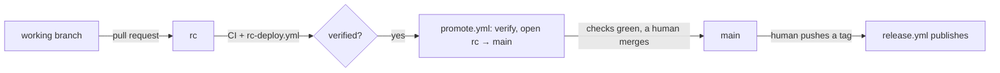

# Branches, gates, and promotions

How a change reaches this repository, and what refuses it on the way. The
enforcement is real code — `.github/workflows/flow.yml`,
`scripts/flow-guard.mjs`, `scripts/hooks/pre-push` — so this page describes
machinery rather than manners; when the two disagree, the machinery is what
happened and this page is a bug.

Two long-lived branches, and one retired:

| Branch | What it is | How it moves |
| :--- | :--- | :--- |
| `rc` | The integration branch, and the staging environment. Every pull request targets it. | Merging pull requests (merge commits). |
| `main` | The release trunk. Stable tags are cut here. | One way only: the promotion merge of `rc` into `main`, after `rc` is deployed and verified. |
| `testing` | Retired. The nightly channel is built from `rc` now. | Nothing — delete it (below). |

Everything else — `wt/*`, `agent/*`, `ci/*`, a fork's branch — is a working
branch, and this policy has no opinion about it.

## How a change reaches main



1. **Open a pull request against `rc`.** Not `main` — `main` accepts one source
   and `flow.yml`'s `pr-target` fails any other. Review, CI and the staging
   deploy all happen on the pull request and on `rc`; there is nothing to gain
   by aiming at the trunk, and a red check says so in one line.
2. **The pull request's checks run** — `ci.yml` (invariants, ui, mcp, cli, api,
   desktop), `migrations.yml` when the change touches the migration array, and
   the same gates locally through `bun run verify`.
3. **Merge it into `rc`.** Merge commit: a squash or rebase merge is a single
   new commit that is on neither `main` nor `rc`'s history, and the push guard
   refuses it (see "What the guard can see").
4. **`rc-deploy.yml` deploys `rc`.** Every push to `rc` builds this commit's api
   package and app image, boots it as a fresh instance, and checks it —
   `scripts/deploy-smoke.mjs` is the list: `/api/healthz` ok, the SPA shell
   serving, the Rust api answering, the version reported matching the commit
   built. This is what "deployed in RC" means; it is a rehearsal of the release
   pipeline, not a release (no channel tag moves).
5. **`promote.yml` verifies the promotion.** When that deploy finishes green, the
   workflow re-reads the evidence for `rc`'s tip — the CI run and the `rc-deploy`
   run, from the Actions API — and writes it to the run's summary: the commit,
   the run links, and what it carries since `main`'s tip. With a
   [`PROMOTION_TOKEN`](#the-required-settings) secret configured it opens (or
   refreshes) the `rc → main` pull request itself; without one it stops there and
   prints the exact command, because a pull request opened with the workflow's
   own `GITHUB_TOKEN` starts no workflows and its required checks would never
   report.
6. **The promotion gate re-checks the evidence.** On the promotion pull request,
   `flow.yml`'s `promotion-gate` reads the Actions API and requires a green CI run
   *and* a green `rc-deploy` run for the head commit — the same query
   `promote.yml` makes for the body, so the two cannot disagree.
7. **A person merges it** (or auto-merge does, where a bot token opened the pull
   request and `main`'s required checks include the gate). Merge commit only.
   Deliberately not automatic by default: a merge performed with `GITHUB_TOKEN`
   would land on `main` and start nothing — not `ci.yml`, not the push guard, and
   not the trunk image feed the in-app updater rolls from.
8. **Cut a release when you mean to.** An RC tag on `rc` (`vX.Y.Z-rc.N`) or a
   stable tag on `main` (`vX.Y.Z`) is a human's decision; `release.yml` does the
   rest. [`RELEASING.md`](../RELEASING.md) has the channel machinery.

Nothing in that flow is a judgement call, and no step is skipped by aiming
somewhere else: the only door into `main` is the promotion, and the promotion
cannot open until the commit has been deployed.

## What each gate proves

| Gate | Runs | Proves |
| :--- | :--- | :--- |
| `bun run check` | locally, every time | invariants (including this file's own anchors) + every doc link resolves + generated references are not drifted |
| `bun run verify` | locally, before every push | `check` + typecheck + the ui test suite |
| `ci.yml` | pull requests, pushes to `rc`/`main`, and every publish | the tripwire: each surface's tests, typecheck, and the prod-bundle SPA smoke |
| `migrations.yml` | migration-touching changes | the array replays from zero *and* upgrades a baseline, with the schema snapshot undrifted |
| `rc-deploy.yml` | every push to `rc` | the commit's own image boots as a fresh instance and answers — the staging deploy |
| `promotion-gate` (flow.yml) | the promotion pull request | the commit was verified in `rc`: CI green, deploy green |
| `judge.yml` | every pull request | the standards half: the flow, the changelog claim against the surfaces touched, tests, generated trees, commit subjects — plus one sticky comment. Not a required check yet, on purpose |
| `branch-push` (flow.yml) | pushes to `main`, `rc`, `testing` | content provenance: what a push introduces came from where it is allowed to come from |
| `pre-push` (git hook) | a push from a wired clone | the same provenance rule, before the network |
| `release.yml` | tags, and 03:17 UTC | the published channel images, the GitHub Release, the desktop installers |

## Promoting

`promote.yml` does the offering. Two of its steps are things a person would otherwise have to
remember, so they are worth knowing exactly:

1. **It fires when either half of the evidence finishes, and offers only when both are
   green.** `ci.yml` and `rc-deploy.yml` both start on a push to `rc` and neither is guaranteed
   to finish first; with one green and one still running, the run says so and waits for the
   other. A promotion gate that runs before its evidence exists can only fail — and a failed
   required check is not re-evaluated, so "offer early" is not a small mistake.
2. **It writes the evidence where you will read it**: the run's summary carries the tip, the CI
   and deploy run links, and the commits since `main`'s tip. Then the token decides the shape:
   - **`PROMOTION_TOKEN` set** — a fine-grained PAT or GitHub App installation token with
     `contents: read` and `pull-requests: write`. The workflow opens (or refreshes) the
     `rc → main` pull request and arms auto-merge, but only when `main`'s required checks
     actually name `promotion gate (rc verified)`: auto-merge waits for required checks and
     nothing else, so anything weaker would merge `rc` without the gate.
   - **No token** — GitHub starts no workflows for events caused by `GITHUB_TOKEN`, so a pull
     request the workflow opened would never have its checks report, and `main`'s protection
     would hold it open for ever. The workflow stops at the summary and prints the exact
     command; the pull request you open runs every check.

Either way **a person merges it** (or the bot token does, where it opened the request and armed
auto-merge), as a merge commit. Deliberately never `GITHUB_TOKEN`: a merge made with it would
land on `main` and start nothing — not `ci.yml`, not the push guard, and not the trunk image
feed the in-app updater rolls from.

Three decisions that shape this, stated because they are policy rather than accident:

- **Nothing auto-merges work into `rc`.** A pull request is merged by a person. Auto-merge is
  available for the promotion step only, and only when `PROMOTION_TOKEN` is configured — with
  no secret, the default posture is that every merge here is a human's.
- **Conflicts are the author's.** Both branches are linear where it matters and neither is
  rebased by machinery: a branch behind `rc` is brought up to date by whoever owns it. A
  promotion's merge is the exception that proves the rule — it introduces no content, and
  `flow-guard` refuses a merge whose tree is not the tree it merged, precisely so a
  hand-resolved conflict cannot ride into `main` without passing through `rc` first.
- **No "Update branch" click on promos.** `strict` is off on `main` (see the recipe below), so a
  promotion merges without one; the merge is clean by construction because `rc` already contains
  everything `main` has.

## The required settings

The guards in the repo are tripwires: they report, and somebody acts. What
*stops* a push is GitHub's own branch protection, and those settings live in the
repository, not in this tree — so they are the one part of this model that a
commit cannot enforce. Set them once, and again if a rule is ever edited:

```bash
# main — the trunk. Merge commits only (squash/rebase would rewrite the commits
# the staging deploy verified), no bypass, and the checks below. No required
# approval: the content was reviewed on rc, and the promotion is machine-verified.
# `strict: false` matters here for the same reason it does on rc, only more so:
# after a promotion, main's tip is the merge commit — which rc does NOT contain —
# so "require branches to be up to date" would block every later promotion until
# somebody clicked Update branch, producing a merge on rc that changes nothing.
# What makes the promotion safe is not being tested against main's tip (it adds
# no content of its own); it is the gate reading CI's and the deploy's runs for
# the head commit.
gh api -X PUT "repos/outcrop-labs/talaria/branches/main/protection" \
  -H 'Accept: application/vnd.github+json' --input - <<'JSON'
{
  "required_status_checks": {
    "strict": false,
    "contexts": [
      "what changed",
      "invariants (no deps)",
      "test + typecheck (ui)",
      "typecheck + build (mcp)",
      "typecheck + test (cli)",
      "fmt + clippy + test (api)",
      "fmt + clippy + test + typecheck (desktop)",
      "pr target (main takes rc only)",
      "promotion gate (rc verified)"
    ]
  },
  "enforce_admins": true,
  "required_pull_request_reviews": null,
  "restrictions": null,
  "allow_force_pushes": false,
  "allow_deletions": false,
  "required_conversation_resolution": true,
  "required_linear_history": false
}
JSON

# rc — the integration branch. The same ci.yml jobs (there is no promotion
# gate above it, and flow.yml's checks are for the pull request to MAIN: its
# guard for rc runs on the PUSH, not on a pull request, and a required check
# that never reports on a pull request wedges the merge). `strict: false`: a
# pull request's checks run against GitHub's merge commit either way, so
# requiring an up-to-date base would only add rebase churn.
gh api -X PUT "repos/outcrop-labs/talaria/branches/rc/protection" \
  -H 'Accept: application/vnd.github+json' --input - <<'JSON'
{
  "required_status_checks": {
    "strict": false,
    "contexts": [
      "what changed",
      "invariants (no deps)",
      "test + typecheck (ui)",
      "typecheck + build (mcp)",
      "typecheck + test (cli)",
      "fmt + clippy + test (api)",
      "fmt + clippy + test + typecheck (desktop)"
    ]
  },
  "enforce_admins": true,
  "required_pull_request_reviews": {
    "required_approving_review_count": 1,
    "dismiss_stale_reviews": true
  },
  "restrictions": null,
  "allow_force_pushes": false,
  "allow_deletions": false,
  "required_conversation_resolution": true,
  "required_linear_history": false
}
JSON
```

Things about that list that are easy to get wrong:

- **A required check has to be able to REPORT on the pull request it guards.**
  flow.yml's `branch-push` job is triggered by a push, so it is not on rc's
  list: it would sit "pending" for every pull request aimed at rc and block it
  for ever. Its rc-side work still happens — on the push that follows the
  merge, where a red run names the commit — but the gate that stops a bad PR is
  branch protection's "require a pull request", not a check that cannot report.
  The two flow.yml checks on main's list DO report there: `flow.yml` triggers on
  pull requests to `main`.
- **Merge commits only, on BOTH branches.** GitHub's "merge method" settings are
  per repository ("Allow merge commits / squash merging / rebase merging"), so
  squash and rebase have to be turned off in Settings → General. The guard
  refuses them if they are switched back on, but a guard that has to fire is a
  broken merge already in `rc`.
- **`strict` is off on BOTH branches, for two different reasons, and both are
  deliberate.** On `rc` a pull request's checks run against GitHub's merge commit
  either way, so requiring an up-to-date base would only add rebase churn. On
  `main` it is load-bearing the other way: after a promotion, main's tip is the
  merge commit and rc does not contain it, so `strict: true` would block every
  later promotion until someone clicked "Update branch" — and that click would
  put a merge on `rc` that changes nothing. What makes a promotion safe is not
  being tested against main's tip (it adds no content of its own); it is the gate
  reading CI's and the deploy's runs for the head commit.
- **`migrations` is deliberately NOT in either list.** Its workflow is filtered
  by `paths:`, and a required check whose workflow never starts reports nothing
  at all — which branch protection reads as "pending" and blocks the merge with.
  The jobs above are safe because they skip per *job*, and a job skipped by a
  job-level `if` is reported as a success.
- **`PROMOTION_TOKEN` decides whether `promote.yml` can open the pull request
  at all.** GitHub creates no workflow runs for events caused by the
  repository's `GITHUB_TOKEN`, so a promotion pull request opened with the
  default token would never have its checks report — and main's protection would
  hold it open for ever. Without a bot token the workflow therefore stops at
  "verified and ready" and prints the command for a person to open it (which
  works: a person's pull request runs every check). To have the workflow manage
  it, add a repository secret `PROMOTION_TOKEN` — a fine-grained PAT or GitHub
  App installation token with `contents: read` and `pull-requests: write` — and
  turn on **Allow auto-merge** (Settings → General). Auto-merge is armed only
  when main's required checks actually include `promotion gate (rc verified)`;
  otherwise the workflow warns and leaves the merge to a human, because
  auto-merge waits for required checks and nothing else.
- **The judge is deliberately NOT on this list either.** `judge.yml` runs on every pull request
  and fails on a `must`, and it is left advisory because a judge with a false positive that
  blocks a merge teaches everyone to route around it. When its findings have earned the trust,
  add `judge (standards)` to the contexts above — the same path every other check here took.
- **`required_approving_review_count: 1` on `rc` assumes more than one
  maintainer.** GitHub does not let an author approve their own pull request, so
  a solo maintainer cannot merge their own work under that rule. Either set it to
  `0` until there is a second reviewer, or keep it and merge through a
  collaborator's approval.

## What the guard can see, and what it cannot

`scripts/flow-guard.mjs` is one implementation with two wirings (`flow.yml`
server-side, `scripts/hooks/pre-push` locally), and its rules are about CONTENT
PROVENANCE rather than identity — a branch tip says nothing about who pushed it,
and no client-side check can ask. What it reads is where the commits came from:

- **`main`**: every commit a push introduces that is not a merge commit must
  already be reachable from `rc`, AND a merge's tree must equal the tree of the
  branch it merged (`after^2`) — main takes `rc` whole, and a merge with anything
  of its own is a merge with unreviewed content in it. So a direct push to
  `main`, a squash merge, a rebase merge and a hand-made merge with an edit
  smuggled inside all fail — and a fast-forward of `main` to `rc`'s tip passes.
- **`rc`**: the tip must be a merge commit, or every introduced commit must
  already be reachable from `main` (a sync of the trunk, the one hand-made push
  `rc` allows). This rule cannot see INSIDE a merge — a local merge that adds a
  file is indistinguishable from a pull request merge by this test — which is
  exactly why "require a pull request" is part of `rc`'s protection: the guard
  catches the shapes a bypass leaves, and branch protection prevents the bypass.
- **Neither** may be rewritten or deleted by a push: a force-push would erase
  commits a promotion or an RC deploy record refers to.
- **`testing`**: a push to it is refused with the reason, and a pull request
  targeting it likewise. Deleting it is the one thing a push may do — the
  documented `git push origin :testing` — because that IS the retirement.

It deliberately cannot tell a reviewed pull request merge from a local
`git merge` into `rc` — that is branch protection's job, and it is the reason the
rules above are the ones worth checking from a client: they fail closed on the
content shapes only a bypass produces, and they fail closed on an unknown (an
unresolvable base — including the tip a force-push discarded — a missing
`origin/rc`, a shallow clone) rather than passing because they could not tell.

## Bringing the model up on an existing repository

One-time, and the order matters — the last two steps need the first two:

1. **Land this machinery on `rc`, then on `main` once by hand.** `flow.yml`,
   `rc-deploy.yml` and `promote.yml` have to exist on the default branch before
   `workflow_run` and `schedule` can fire at all, and branch protection has not
   been applied yet, so the first promotion is a merge commit a human makes:

   ```bash
   git switch rc && git merge --no-ff origin/main   # or merge the pull request that carries this
   git switch main && git merge --no-ff rc && git push origin main
   ```

2. **Apply the protection above** (and turn off squash/rebase merging). Add the
   `PROMOTION_TOKEN` secret if you want `promote.yml` to open the promotion pull
   request itself, and turn on "Allow auto-merge" only alongside it — see the
   first and last bullets under the recipe. Without the secret, every promotion
   is a pull request you open from the summary's compare link and merge once its
   checks are green, which is the same gate one click less convenient.
3. **Delete `testing`**, once you are sure nothing reads it:

   ```bash
   git push origin :testing
   ```

   The nightly channel stops depending on it the moment `release.yml` in step 1
   lands: it builds `rc`'s tip.

4. **Cut an RC when you want one**, and let the promotion follow it:

   ```bash
   git tag v0.2.0-rc.1 && git push origin v0.2.0-rc.1   # on rc
   ```

## If a promotion is wedged

- **No promotion pull request appeared.** The run's summary says which: "not ready to promote"
  (one of the two runs is red or still going — a red one needs a fix on `rc`, and a new push
  re-runs both), or "no pull request was opened for you" (no `PROMOTION_TOKEN` — open it from
  the compare link and merge it). If `rc-deploy.yml` is red and the commit is fine, re-run that
  run or dispatch the workflow from `rc`; the gate reads runs by commit, so either clears it.
- **A promotion pull request sits at "Expected — Waiting for status to be
  reported".** That is the `GITHUB_TOKEN` rule: a pull request opened by a
  workflow with the repository token starts no workflows, so its checks never
  report. Close it and open one yourself (your events do start them), or add the
  `PROMOTION_TOKEN` secret so the automation can open them properly.
- **Auto-merge never fired.** Its log says which of the three cases it hit: the
  protection rule could not be read, main's required checks do not include
  `promotion gate (rc verified)`, or the API refused to arm it. All three are
  merge-by-hand plus a settings fix (this section's recipe) — a promotion is not
  the place to discover a missing checkbox.
- **The gate reports no green run for a commit that otherwise looks green.** It reads runs by
  commit, so the run has to be of that exact commit: a re-run of `rc-deploy` (or a dispatch of
  it from `rc`) verifies the same tree and clears it; a dispatch of *something else* does not,
  and a re-run of a pull request's checks is not a run of `rc-deploy` at all.