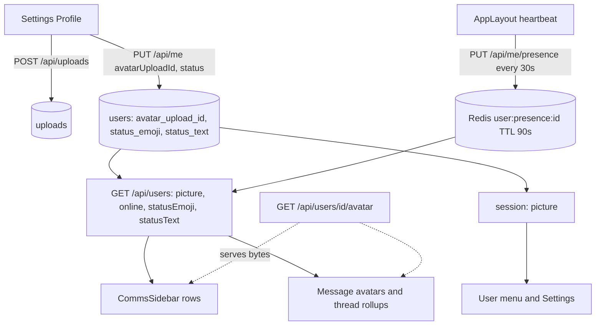
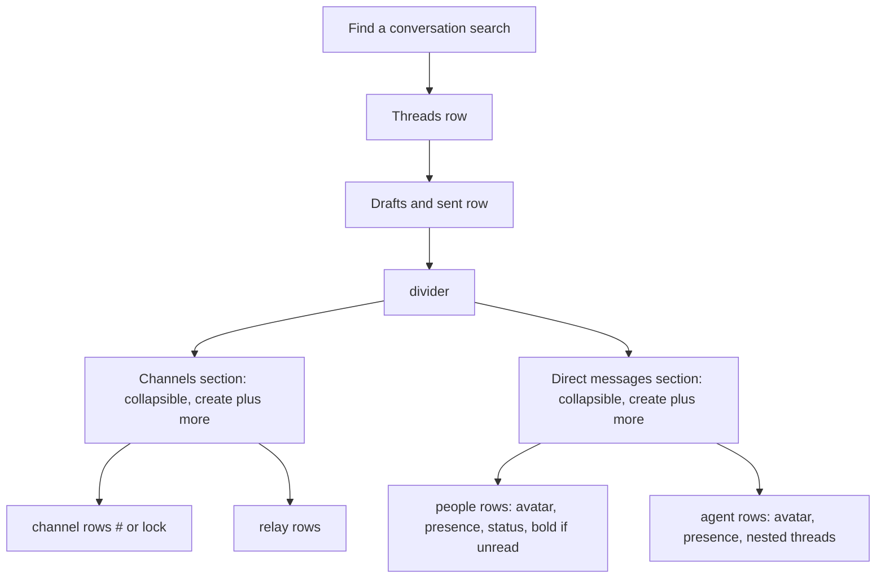

# Comms UI Overhaul - Plan

## Goal Capsule

- **Objective:** People using Talaria Comms can tell when each message was sent, react and branch into threads from any message, see at a glance who is online and what they haven't read, and recognize teammates by their photo, all inside Talaria's existing look.
- **Means:** Restructure Comms layout and interactions toward familiar team-chat patterns on the existing design tokens and `ui/src/components/ui/` primitives (KTD1), with small additive API changes for timestamps, agent-chat reactions, presence, status, and profile photos.
- **Authority:** Product Contract requirements win on behavior. KTDs win on mechanism. Units override neither.
- **Stop conditions:** Stop and report if the work would change design tokens, colors, or typography; if an avatar would become readable by anyone outside the org; or if a migration would need to rewrite existing rows.
- **Execution profile:** One branch, one PR against `rc`. Units land as separate commits in dependency order.
- **Finishing:** The implementing agent runs the gates and opens the PR. A person reviews and merges.

---

## Product Contract

### Summary

Comms gets date dividers and send times on every transcript. A hover toolbar on messages offers quick reactions, a full emoji picker, and reply-in-thread. Threads get a rollup row. The sidebar is reorganized into search, Threads, Drafts & sent, and collapsible Channels and Direct messages sections. Rows show presence, an optional status emoji, unread rows in bold, and profile photos. People can upload a profile photo in Settings, and it appears everywhere their avatar does.

### Problem Frame

The user recorded a walkthrough (Supercut "Telaria UI/UX Enhancements", 2026-10-05) walking through Talaria Comms and what to improve. Today agent DMs show no date or time on any message. The hover affordances are thin. Sidebar dots don't distinguish online from offline. Unread rows look like read ones. The sidebar is a flat list of Channels / Relays / Teammates / Agents headings with no search. Everyone is shown as mono initials because there is no way to set a photo. Channels already carry reactions, threads, and a thread panel. Agent DMs, which is where the user spends their time, carry none of it.

### Key Decisions

- **Talaria's look stays; only layout and interaction change.** (session-settled: user-directed — chosen over copying another product's visual styling: "I want the branding of Telaria to remain the same… just more polish.") Governs R1–R19.
- **Presence reads filled green dot = online, hollow ring = offline.** (session-settled: user-directed — chosen over the current gray dots: user asked for these semantics.) Governs R11.
- **Unread conversations render bold; read ones normal weight.** (session-settled: user-directed — chosen over unread count pills alone: explicit request.) Governs R12.
- **Threads open in a right-side slide-out pane, with an avatars + "N replies" + last-reply rollup on the parent.** (session-settled: user-directed — chosen over inline-expanded threads: explicit request.) Governs R7, R8.
- **Sidebar order: search, Threads, Drafts & sent, divider, collapsible Channels, collapsible Direct messages.** (session-settled: user-directed — chosen over the flat Channels/Relays/Teammates/Agents headings: explicit request.) Governs R14, R15.
- **The profile photo is uploaded in Settings → Profile and propagates to every avatar.** (session-settled: user-directed — chosen over initials only: explicit request.) Governs R17, R18.

### Requirements

**Transcript**

- R1. Every Comms transcript (channels, people DMs, agent DMs, thread pane) shows a centered date divider before the first message of each calendar day, labeled "Today", "Yesterday", or a full date like "Tuesday, April 7th", in the viewer's timezone.
- R2. Every message header shows its send time beside the author name, including user and agent turns in agent DMs.
- R3. Avatars on message rows show the author's photo when one exists, falling back to initials.

**Message actions**

- R4. Hovering a message highlights the row and shows a floating toolbar at its top-right with quick reactions ✅ 👀 🙌, an add-reaction button that opens the full emoji picker, and (where threads apply) reply-in-thread.
- R5. Reactions render as chips under the message with emoji and count. A trailing add-reaction chip opens the picker. Clicking a chip toggles the viewer's own reaction.
- R6. Agent DM messages accept reactions with the same toolbar and chips as channel messages.

**Threads**

- R7. Reply-in-thread opens the right-side Thread pane: parent message on top, an "N replies" rule, the replies, and a compact reply composer.
- R8. A parent message with replies shows a rollup row of up to three stacked participant avatars, an "N replies" link, and "Last reply <relative time>". Clicking it opens the Thread pane.
- R9. @mentions render as highlight chips. A mention of the viewer uses a distinct, stronger highlight.

**Sidebar**

- R10. Every person and agent row in the sidebar carries a presence indicator.
- R11. The presence indicator is a filled green dot when online and a hollow ring when offline.
- R12. A conversation row with unread messages renders in bold, full-ink text. A read row renders normal weight and muted.
- R13. A person may set a status emoji and short status text (e.g. 📅 "In a meeting"). It shows beside their name in sidebar rows and in the DM header.
- R14. The sidebar top is a "Find a conversation" search input that filters every section below it, then nav rows for Threads and Drafts & sent, then a divider.
- R15. Below the divider sit two collapsible sections. Channels lists channels (`#` or lock glyph) and relays. Direct messages lists people and agents. Each section header has a create action and a more-actions menu. Collapse state persists across reloads.
- R16. Threads shows the threads the viewer started or replied in, newest activity first. Drafts & sent shows unsent composer drafts and the viewer's recently sent messages. Each item opens its conversation.

**Profile photo**

- R17. Settings → Profile lets a person upload a profile photo (PNG, JPEG, WebP, or GIF up to 5 MB) and remove it.
- R18. The uploaded photo replaces the Google picture everywhere the person's avatar appears: user menu, settings, sidebar DM rows, message avatars, thread rollups. Without an upload, the Google picture (if any) still shows.
- R19. Agents show an image where one exists. Otherwise they show their existing glyph/initials avatar.

### Acceptance Examples

- AE1. **Covers R1.** Given messages from Sept 4 and two from today, when the transcript renders, then one "Friday, September 4th" divider precedes the first and one "Today" divider precedes the two from today.
- AE2. **Covers R5, R6.** Given an agent reply, when the viewer clicks 🙌 in the hover toolbar, a "🙌 1" chip appears in their highlighted style. Clicking the chip removes it.
- AE3. **Covers R11.** Given a teammate who last pinged presence 2 minutes ago, the sidebar shows a hollow ring. After they open Talaria, a filled green dot shows within one directory refresh.
- AE4. **Covers R18.** Given a user with a Google picture who uploads a photo and later signs in with Google again, the uploaded photo still shows.

### Scope Boundaries

- Nested reply threads inside agent DMs are out. An agent conversation is already a topic-bounded thread, and the sidebar nests those threads under the agent.
- Drafts are browser-local. Cross-device draft sync is out.
- Huddles, Directories, Starred, canvases, and Files & links tabs shown in the reference frames are out.

### Deferred to Follow-Up Work

- Uploading an agent avatar from the Agents page (R19 only renders an image if one is ever provided).
- Server-side composer drafts.
- Realtime presence push over SSE. This plan polls.

---

## Planning Contract

### Key Technical Decisions

- KTD1. **Reuse the existing primitives and tokens.** `Avatar`, `StatusDot`, `Popover`, `EmojiPicker`, `RailRow`, `CountPill`, `IconButton`, `Input`, and `GroupHeader` cover every new element. No new colors: presence-online uses the existing success/healthy token, and self-mentions use the accent token at stronger fill. Instantiates the "Talaria's look stays" Key Decision (R1–R19).
- KTD2. **One shared `MessageActions` hover bar and `ReactionChips` component serve both channel rows and agent-DM turns.** `MessageRow.svelte` already hand-rolls the toolbar and chips. Extracting them keeps one behavior across the two transcript implementations. Quick set is ✅ 👀 🙌. The add-reaction button opens `EmojiPicker`, which replaces the fixed `REACTION_SET` palette.
- KTD3. **Date dividers come from one pure grouping helper** (`ui/src/lib/day-dividers.ts`) that takes items plus a timestamp accessor and returns day boundaries with labels. Both transcripts call it, and the labels use the user's timezone preference (`TimezonePicker` / `users.timezone`) when set, else the browser's.
- KTD4. **Agent DM messages gain `id` and `createdAt` on the wire.** `MessageRow` in `api/crates/talaria-conversations/src/lib.rs` already selects from `messages`, which has `id` and `created_at`. Adding the two fields is additive and older clients ignore them.
- KTD5. **Agent DM reactions live in a new `message_reactions` table** mirroring `channel_message_reactions` (`message_id, emoji, actor, actor_type, created_at`, PK `(message_id, emoji, actor)`). A new toggle route `POST /api/conversations/{id}/messages/{msgId}/reactions` follows the channel route's validation and access rules. Reactions are decorated onto the message wire like `decorate_messages` does for channels. Reusing the channel table was rejected because its `message_id` references `channel_messages`.
- KTD6. **Global presence is a Redis heartbeat key with a TTL.** The client calls `PUT /api/me/presence` every 30s while the tab is visible. The server sets `user:presence:{id}` with a 90s TTL. `GET /api/users` reports `online` from a batched key read, and the client's directory query polls with `refetchInterval: 30_000` (TanStack skips background tabs) so dots refresh while Comms stays open. A failed presence read degrades to `online: false` for everyone, never a failed directory. This copies the proven plan-presence pattern (`talaria-routes-boards/src/plans/plans_id_members.rs`) rather than inventing a socket. Agent presence derives from fleet status: `offline` maps to offline, every other status to online.
- KTD7. **Status is two nullable columns on `users`** (`status_emoji`, `status_text`), written through the existing `PUT /api/me` patch and returned by the directory and session. Bounds: emoji 1–16 chars, text ≤ 100 chars.
- KTD8. **The profile photo is a new `users.avatar_upload_id` column, never a write to `users.picture`.** Google login overwrites `picture` on every sign-in (`talaria-users/src/lib.rs` upsert), so a custom photo must live elsewhere (AE4). The photo bytes go through the existing `POST /api/uploads`. `PUT /api/me { avatarUploadId }` claims the upload after checking the caller owns it and it is an allowed image type within 5 MB. Null clears it. A new route `GET /api/users/{id}/avatar` serves the bytes to any signed-in org user and to agents. This bypasses the conversation-scoped `can_access_upload` for this one upload only, with an immutable cache header. Session and directory expose one effective `picture` URL: the avatar route (with a version query) when an upload is set, else the Google picture.
- KTD9. **The sidebar becomes its own component**, `ui/src/routes/app/comms/CommsSidebar.svelte`. `Comms.svelte` keeps selection and routing, and the sidebar receives data plus callbacks. Collapse state is stored with the `readStored`/`writeStored` helpers in `ui/src/lib/persist.ts` (localStorage). Search is a client-side, case-insensitive filter over loaded rows. A "more actions" menu reuses `ContextMenu` entries.
- KTD10. **Threads and Sent are two read endpoints, and Drafts are local.** `GET /api/me/threads` returns roots in the viewer's channels that they authored or replied to, ordered by last reply. `GET /api/me/sent` returns the viewer's latest 50 channel messages and agent-DM user turns. Drafts are saved in localStorage by the composers (`ui/src/lib/comms-drafts.ts`) under `comms-draft:{userId}:{key}`, where key is the conversation/channel id, or `agent:<model>:new` for an unsaved agent thread (opened at `/comms/agent/<model>` with the draft restored). They are cleared on send, and the Drafts view reads only the current user's keys. The new views live at `/comms/threads` and `/comms/drafts`, and `comms-selection` gains those two tags.

### High-Level Technical Design

Data flow for the new identity fields:

Sidebar composition:

### Assumptions

- Teammates and agents share one Direct messages section, with people listed first, then agents. Agent threads stay nested under their agent row as today.
- Relays stay inside Channels with their existing ⇄ glyph rather than getting a third section.
- "Online" means the person had Talaria open in a visible tab within the last 90 seconds.
- Status has no expiry. Clearing it is manual.
- The checkbox reaction the user described as "completed" is the ✅ emoji, not a separate task state.
- Mobbin was requested for extra reference frames but its MCP was not connected this run. Reference comes from the recording frames only.

### Risks & Dependencies

| Risk | Mitigation |
|---|---|
| The avatar route widens read access to an upload | Only uploads claimed through `avatar_upload_id` are served by it; the route looks up the user's column, never accepts an upload id from the URL |
| Migrations are append-only by array index in `ui/src/server/db/pg.ts` | Append at the end only, one statement per entry, regenerate `schema.snapshot.sql` |
| Two transcript implementations drift | KTD2/KTD3 shared components and helper are the single owners |
| Presence polling load | One `SET EX` per user per 30s and one `MGET` per directory poll per open tab (30s) |

---

## Implementation Units

### U1. Identity fields: photo, status, presence (API)

- **Goal:** Persist and serve profile photos, status, and presence (R11, R13, R17, R18).
- **Requirements:** R10, R11, R13, R17, R18. KTD6, KTD7, KTD8.
- **Dependencies:** none.
- **Files:**
  - `ui/src/server/db/pg.ts` (append migrations: `users.avatar_upload_id uuid`, `users.status_emoji text`, `users.status_text text`)
  - `ui/src/server/db/schema.snapshot.sql`
  - `api/crates/talaria-users/src/lib.rs` (directory row, avatar lookup, status setters, effective picture)
  - `api/crates/talaria-session/src/lib.rs` (status on session wire)
  - `ui/src/lib/users.ts` (`refetchInterval: 30_000`)
  - `api/crates/talaria-routes-integrations/src/account/me.rs` (patch: `avatarUploadId`, `statusEmoji`, `statusText`)
  - `api/crates/talaria-routes-integrations/src/account/users.rs` (`picture`, `online`, `statusEmoji`, `statusText`)
  - new `api/crates/talaria-routes-integrations/src/account/me_presence.rs`, `users_id_avatar.rs`
  - `api/crates/talaria-api-routes/src/routes/mod.rs`
  - tests beside each crate (`#[cfg(test)]` modules / existing live-test files)
  - `docs/api/` regenerated
- **Approach:**
  1. Append the three migrations.
  2. Extend the `PUT /api/me` validator with the new optional fields and their bounds. Claim the avatar upload only if `uploads.uploaded_by` is the caller, the mime is `image/png|jpeg|webp|gif`, and the size is ≤ 5 MB.
  3. Compute the effective picture in one helper used by both session and directory. The URL `/api/users/{id}/avatar?v=<upload id prefix>` busts caches on change.
  4. Avatar route: `require_user` or agent caller, then look up the user's `avatar_upload_id`, then stream via `talaria-uploads` serve logic with `Cache-Control: private, max-age=31536000, immutable`. Return 404 when unset.
  5. Presence route: `require_user`, `SET user:presence:{id} 1 EX 90`, return `{ ok: true }`. Directory reads all keys in one `MGET`. If Redis is unreachable or the read fails, log it and return every user with `online: false`.
  6. Return the effective picture from `upsert_user`/`link_by_email` in `talaria-users` so every login path (Google callback, password, claim) stores it in the session snapshot. `PUT /api/me` pushes the new `picture`/status to all of the user's sessions via `update_sessions_for_user`, not only the current cookie.
- **Patterns to follow:** `plans_id_members.rs` presence. `channels_id_messages_msgid_reactions.rs` thin handler shape. The existing `validate_me_patch`.
- **Test scenarios:**
  - `PUT /api/me` with an owned PNG upload sets `avatar_upload_id`, and the session `picture` becomes the avatar route.
  - `PUT /api/me` with another user's upload id returns 403 and changes nothing.
  - `PUT /api/me` with a PDF upload or a 6 MB image returns 400 with a sentence error.
  - `PUT /api/me { avatarUploadId: null }` restores the Google picture.
  - Covers AE4. A Google-login upsert after an upload leaves the effective picture on the avatar route.
  - `GET /api/users/{id}/avatar` for a user without an upload returns 404. With an upload, a different org member gets the bytes.
  - Status: a 17-char emoji or 101-char text returns 400. Valid values round-trip through `/api/users`.
  - Directory with Redis unavailable returns 200 with every user `online: false`.
  - Covers AE3. Presence: after `PUT /api/me/presence`, the directory reports `online: true` for that user and `false` for one who never pinged.
- **Verification:** The new routes appear in `docs/api/`, `bun run gate` passes for the touched crates, and the migration check is clean.

### U2. Agent DM wire: ids, timestamps, reactions (API)

- **Goal:** Give agent DM messages what channel messages have for R2 and R6.
- **Requirements:** R2, R5, R6. KTD4, KTD5.
- **Dependencies:** none.
- **Files:**
  - `ui/src/server/db/pg.ts`, `ui/src/server/db/schema.snapshot.sql` (append `message_reactions` table + PK + FK on `messages(id) on delete cascade`)
  - `api/crates/talaria-conversations/src/lib.rs` (`MessageRow.id`, `created_at`, `reactions`; toggle fn)
  - new `api/crates/talaria-routes-comms/src/comms/conversations_id_messages_msgid_reactions.rs`
  - `api/crates/talaria-routes-comms/src/comms/mod.rs`, `api/crates/talaria-api-routes/src/routes/mod.rs`
  - `ui/src/lib/conversations.svelte.ts` (`StoredMessage.id`, `createdAt`, `reactions`; `toggleConversationReaction`)
  - `ui/src/components/chat/chat-view.ts` (`DisplayMessage` carries them)
  - `docs/api/` regenerated
- **Approach:** Select `m.id::text` and `m.created_at` as ISO strings, then decorate with grouped reactions in one query keyed by message ids. The toggle route requires conversation access (owner or collaborator) using the same access check as the conversation read. It rejects a message id that doesn't belong to the conversation, and validates the emoji as 1–16 chars. Only user actors are written.
- **Patterns to follow:** `toggle_reaction` and `decorate_messages` in `api/crates/talaria-channels/src/lib.rs`.
- **Test scenarios:**
  - Conversation detail returns `id` and ISO `createdAt` for each message, in seq order.
  - Covers AE2. Toggling 🙌 on an assistant message adds it, and toggling again removes it. The detail reflects both states.
  - Toggle on a message from a different conversation returns 404.
  - Toggle by a user with no access to the conversation returns 403/404 per the read rule.
  - An empty or 17-char emoji returns 400.
  - Deleting the conversation cascades its reactions.
- **Verification:** The UI type check passes with the new fields, and the cargo tests for the two crates pass.

### U3. Threads and Sent read endpoints (API)

- **Goal:** Back the sidebar's Threads and Drafts & sent views (R16).
- **Requirements:** R16. KTD10.
- **Dependencies:** none.
- **Files:**
  - `api/crates/talaria-channels/src/lib.rs` (queries)
  - new `api/crates/talaria-routes-comms/src/comms/me_threads.rs`, `me_sent.rs`
  - `api/crates/talaria-api-routes/src/routes/mod.rs`, `docs/api/`
- **Approach:**
  - `GET /api/me/threads` returns `{ threads: [{ channelId, channelName, channelKind, root: ChannelMessageWire, lastAt }] }`. It covers roots with at least one reply, in channels the viewer is a member of, where the viewer authored the root or a reply. Newest `lastAt` first, limit 50.
  - `GET /api/me/sent` returns `{ messages: [{ kind: 'channel'|'agent', conversationId, title, content, createdAt }] }`. It merges the viewer's channel messages and agent-DM user turns, newest first, limit 50.
- **Patterns to follow:** `list_thread_messages` and the `MSG_PAGE_*` query style in `talaria-channels`.
- **Test scenarios:**
  - Threads includes a root the viewer replied to but did not author, and excludes a thread in a channel they left.
  - Threads excludes roots with zero replies.
  - Sent merges channel and agent turns in createdAt order and never includes another user's messages.
  - An unauthenticated request returns 401.
- **Verification:** The routes are documented and the tests pass.

### U4. Shared transcript chrome (UI)

- **Goal:** One implementation of date dividers, times, hover actions, reaction chips, and photo avatars (R1–R5).
- **Requirements:** R1, R2, R3, R4, R5. KTD1, KTD2, KTD3.
- **Dependencies:** U1 (directory `picture`).
- **Files:**
  - new `ui/src/lib/day-dividers.ts` + `ui/src/lib/day-dividers.test.ts`
  - new `ui/src/components/chat/DayDivider.svelte`, `MessageActions.svelte`, `ReactionChips.svelte`
  - `ui/src/components/chat/MessageAvatar.svelte` (optional `src`)
  - `ui/src/components/chat/MessageRow.svelte`, `ChannelView.svelte`, `ThreadPanel.svelte`
  - `ui/src/components/chat/channel-view.ts` (drop `REACTION_SET` once unused; `MessageCtx` gains `pictureFor`)
  - `ui/src/lib/users.ts` (`DirectoryUser.picture`, `online`, `statusEmoji`, `statusText`)
- **Approach:**
  - `DayDivider`: a hairline rule with a centered pill in raised-tile style.
  - `MessageRow`: wraps in a hover highlight (`hover:bg-card2` per RailRow's hover token) and uses `MessageActions` (✅ 👀 🙌 · emoji picker via `Popover` + `EmojiPicker` · reply-in-thread · edit/delete kept) and `ReactionChips` with a trailing add chip.
  - `ChannelView` and `ThreadPanel` interleave dividers using the helper.
  - The actions bar also shows on keyboard focus within the row (`focus-within`).
  - Times stay 10px mono, per the spec §10 row anatomy.
- **Patterns to follow:** The existing `MessageRow` toolbar/popover pinning (`bind:open` keeps the bar visible). `EmojiPicker` caller-supplied trigger.
- **Test scenarios:**
  - Covers AE1. The helper places one divider per calendar day, labels today "Today" and yesterday "Yesterday", and labels older dates "Friday, September 4th".
  - The helper respects a supplied timezone: 23:30 UTC on day N lands on day N+1 in Asia/Tokyo.
  - Ordinal suffixes are correct for 1st, 2nd, 3rd, 4th, 11th, 12th, 13th, 21st, 22nd, 23rd.
  - The helper returns no dividers for an empty list, and exactly one for a single message.
- **Verification:** A channel shows dividers and the hover bar in the browser, and `bun run test` covers the helper.

### U5. Thread rollup and mention polish (UI)

- **Goal:** Thread rollup and self-mention highlight (R7–R9).
- **Requirements:** R7, R8, R9.
- **Dependencies:** U4.
- **Files:**
  - `ui/src/components/chat/MessageRow.svelte` (rollup: up to 3 stacked avatars from `m.thread.authors`, "N replies" in accent, "Last reply …" muted)
  - `ui/src/components/chat/ThreadPanel.svelte` (header shows "Thread" + channel name; "N replies" as a rule with label)
  - `ui/src/components/ui/markdown.ts` + `ui/src/components/ui/Markdown.svelte` (optional `selfMentions` names → stronger accent class)
  - `ui/src/components/ui/markdown.test.ts`
- **Approach:** Thread authors are emails or agent models. Resolve them to pictures/initials through `MessageCtx`. Self-mention match is case-insensitive against the viewer's display name and email local part.
- **Test scenarios:**
  - Markdown with `@Zach` and `selfMentions: ['Zach Siegel', 'zach']` renders the self-mention class. `@Gigi` renders the ordinary mention class.
  - Without `selfMentions`, rendering is unchanged from today (regression).
- **Verification:** In the browser, a root with replies shows the rollup and clicking it opens the pane.

### U6. Agent DM transcript parity (UI)

- **Goal:** Agent DMs get dividers, times, hover reactions, and photo avatars (R1–R3, R6).
- **Requirements:** R1, R2, R3, R4, R6. KTD2, KTD3, KTD4.
- **Dependencies:** U2, U4.
- **Files:** `ui/src/components/chat/ChatView.svelte`, `UserTurn.svelte`, `AssistantTurn.svelte`, `ui/src/components/chat/chat-view.ts`
- **Approach:** Pass `createdAt`, `reactions`, and `id` through `DisplayMessage`. Turns render the time beside the name. `MessageActions` shows reactions only (no thread action) and is hidden while a turn is streaming or has no `id` yet. A synthetic streaming row gets `createdAt = now` for divider placement. The user turn's avatar uses the session picture.
- **Test scenarios:**
  - `toDisplay` maps `id`, `createdAt`, and `reactions` from a stored message (`ui/src/components/chat/chat-view.test.ts`, new or existing).
  - A streaming row without `id` has no actions bar (component-level check, or covered in browser verification).
- **Verification:** In the browser, an agent DM shows "Today", times, and toggles a 🙌 reaction that survives reload.

### U7. Comms sidebar restructure (UI)

- **Goal:** The reordered sidebar with search, presence, status, bold unread, and photos, plus the Threads and Drafts & sent views (R10–R16, R19).
- **Requirements:** R10, R11, R12, R13, R14, R15, R16, R19. KTD6, KTD9, KTD10.
- **Dependencies:** U1, U3, U4.
- **Files:**
  - new `ui/src/routes/app/comms/CommsSidebar.svelte`, `PresenceAvatar.svelte`, `ThreadsView.svelte`, `DraftsSentView.svelte`
  - new `ui/src/lib/comms-drafts.ts` + test
  - new `ui/src/lib/comms-sidebar.ts` (pure filter/sort/collapse helpers) + test
  - `ui/src/routes/app/Comms.svelte` (delegate rail, route the two new views)
  - `ui/src/routes/app/comms/Section.svelte` (collapsible header with chevron + more-actions)
  - `ui/src/lib/comms-selection.ts` + `ui/src/lib/comms-selection.test.ts` (`threads`, `drafts` tags)
  - `ui/src/router.ts` (`/comms/threads`, `/comms/drafts`)
  - `ui/src/components/chat/ChannelComposer.svelte`, `ChatComposer.svelte` (save/restore/clear draft)
- **Approach:**
  - `PresenceAvatar` is a 20px `Avatar` with a 7px badge at its bottom-right. Online renders filled with the healthy `DOT_COLOR`. Offline renders a hollow ring with a `border-muted` outline on the panel background.
  - Row text is `font-semibold text-fg` when `unreadCount > 0`, else `text-muted`. `CountPill` stays for counts.
  - The status emoji renders after the name with `title` set to the status text.
  - Search filters channels, relays, people, and agents by name (and email for people). Sections with zero matches hide while a query is active.
  - Collapse state uses `ui/src/lib/persist.ts`. A collapsed section still shows the active row and every row with unread messages.
  - An agent row's unread state is the sum of `unreadCount` across that agent's conversations: bold plus a `CountPill` when above zero, expanded or not.
  - Search also matches agent conversation titles. While a query is active, matching threads show under their agent (agent expanded, 8-row cap lifted), and the agent row stays when only its threads match.
  - A DM channel's header (`Comms.svelte`) shows the peer's presence and status emoji + status text (R13).
  - Section headers: Channels `+` = new channel, more = new relay · mark all read. Direct messages `+` = start a DM (people picker), more = mark all read. Controls show on header hover and keyboard focus. Headers carry `aria-expanded`.
  - Threads and Drafts & sent views get a skeleton while loading, an `EmptyState` ("No threads yet" / "No drafts or sent messages"), and a `QueryError` with retry. When a query hides every section the rail shows "No conversations match". Each draft row has a discard action.
  - `PresenceAvatar` exposes "online"/"offline" in its `aria-label`.
- **Patterns to follow:** The existing `Section`, `RailRow`, `RailFailure`, skeleton snippets, and context menus in `Comms.svelte`. Keep every failure-marker branch.
- **Test scenarios:**
  - The filter helper matches "gi" to "Gigi" and "#growth-footage" case-insensitively, and returns all rows for an empty query.
  - The collapse helper persists and restores per-section state. A collapsed section still yields the active row.
  - `comms-selection` parses `/comms/threads` and `/comms/drafts`, and the restore keeps them.
  - Drafts: saving text for a conversation id, reading it back, clearing on send, and ignoring whitespace-only drafts.
  - Drafts: one user's drafts are invisible under another user id. An `agent:<model>:new` draft round-trips.
  - Collapse helper: a collapsed section still yields unread rows. Agent unread aggregates across its conversations. Search matches a thread title whose agent name does not match.
- **Verification:** In the browser, the sidebar order matches R14/R15, collapse persists across reload, the presence dot flips within ~30s when a second session pings while the viewing window stays focused, and unread rows render bold.

### U8. Profile photo and status in Settings, presence heartbeat (UI)

- **Goal:** Let people upload a photo and set a status, and keep presence alive (R13, R17, R18).
- **Requirements:** R13, R17, R18. KTD6, KTD7, KTD8.
- **Dependencies:** U1.
- **Files:**
  - `ui/src/routes/app/Settings.svelte` (or a new `ui/src/routes/app/settings/ProfilePhotoField.svelte` + `StatusField.svelte`)
  - `ui/src/lib/session.ts` (status fields)
  - new `ui/src/lib/presence.svelte.ts` + heartbeat mount in `ui/src/routes/app/AppLayout.svelte`
- **Approach:**
  - The photo field shows the current `Avatar` at 64px with Upload and Remove buttons. Upload uses the existing uploads client (multipart) and then `PUT /api/me`. It rejects non-images and files over 5 MB client-side before upload.
  - The status field has an `EmojiPicker` trigger plus a text `Input`, saved with the existing Save pattern.
  - The heartbeat pings on mount, every 30s while `document.visibilityState === 'visible'`, and on visibility regain.
  - Each change invalidates `['session']` and `['users']`.
- **Test scenarios:**
  - The heartbeat helper skips pings while hidden and pings once on becoming visible (fake timers + mocked visibility).
  - The client-side validator rejects a 6 MB file and an `application/pdf`, and accepts a 1 MB WebP.
- **Verification:** In the browser, an uploaded photo appears in the user menu, settings, sidebar, and message rows, and removing it restores initials or the Google picture.

### U9. Changelog

- **Goal:** Record the user-visible change.
- **Requirements:** all.
- **Dependencies:** U1–U8.
- **Files:** new `changelog/2026-10-05-comms-ui-overhaul.md`
- **Approach:** Follow the format of existing `changelog/` entries: what changed and what was verified.
- **Test expectation:** none -- documentation only.
- **Verification:** `bun run check` passes.

---

## Verification Contract

| Gate | Command | Proves |
|---|---|---|
| Fast invariants, doc links, generated-doc drift | `bun run check` | `docs/api/` regenerated, changelog shape |
| Diff-scoped compile + tests | `bun run gate` | touched Rust crates (`-p` scoped) and ui typecheck/tests |
| Generated API reference | `bun run docs:api` | new routes documented |
| Migration snapshot | in `ui/`: `bun run migrations:snapshot` after appending, then `bun run migrations:check` | append-only migrations, snapshot matches |
| UI unit tests | `bun run test` | helpers in U4, U5, U7, U8 |
| Browser | `ce-test-browser` against `/comms` and `/settings` | R1–R19 render and behave |

Never run a workspace-wide cargo (`api:check`, unscoped `cargo test`). Use `bun run gate`.

## Definition of Done

- R1–R19 hold in the browser on a channel, a people DM, an agent DM, the thread pane, the sidebar, and Settings → Profile.
- Every unit's test scenarios exist and pass, and `bun run check` and `bun run gate` are green.
- `docs/api/` and `schema.snapshot.sql` are regenerated, never hand-edited.
- No new color, font, or token was added (KTD1).
- No dead code from abandoned approaches remains: `REACTION_SET` is removed if unused, and there are no orphaned components.
- The changelog entry exists.
- The PR against `rc` is open with CI green.
